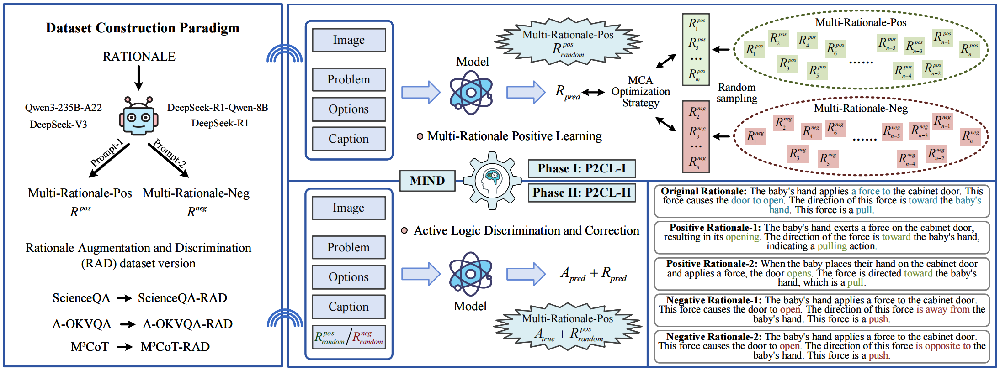
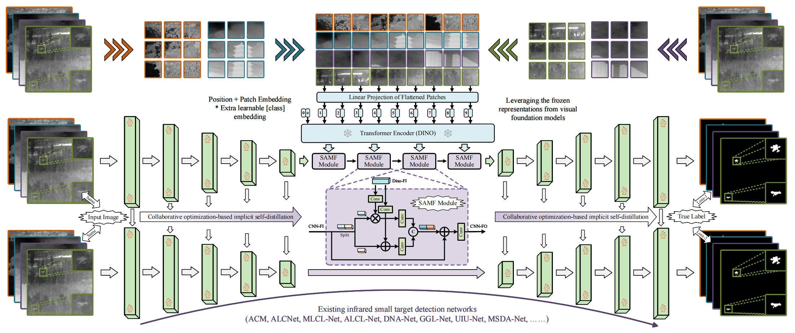
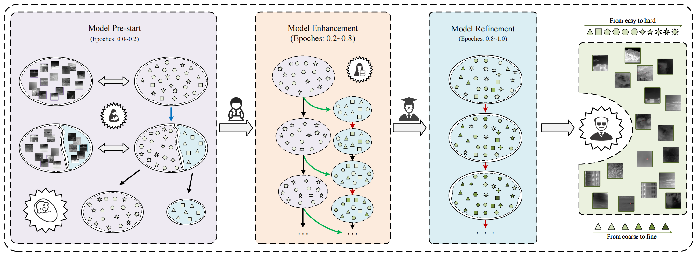
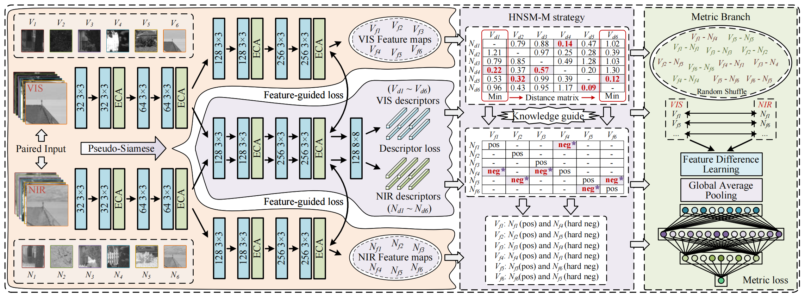
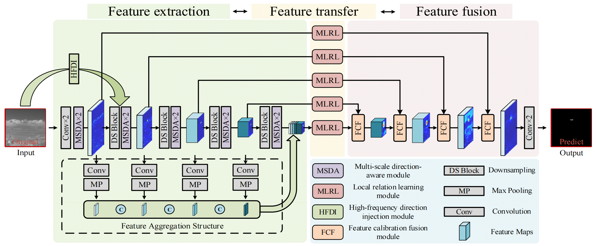
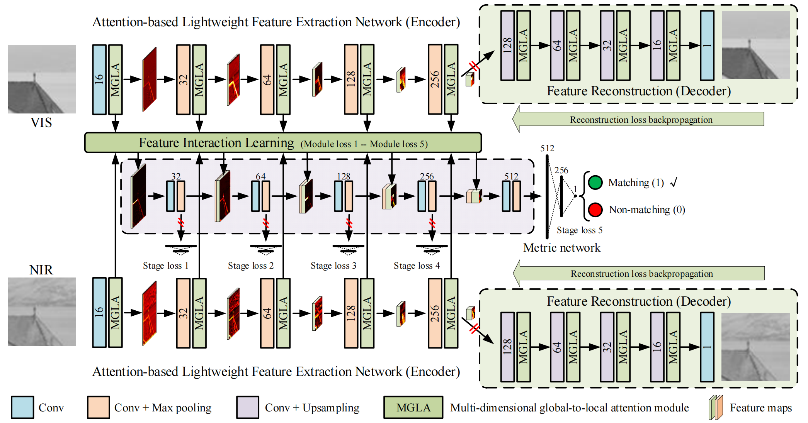
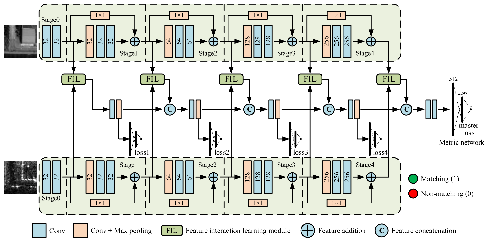
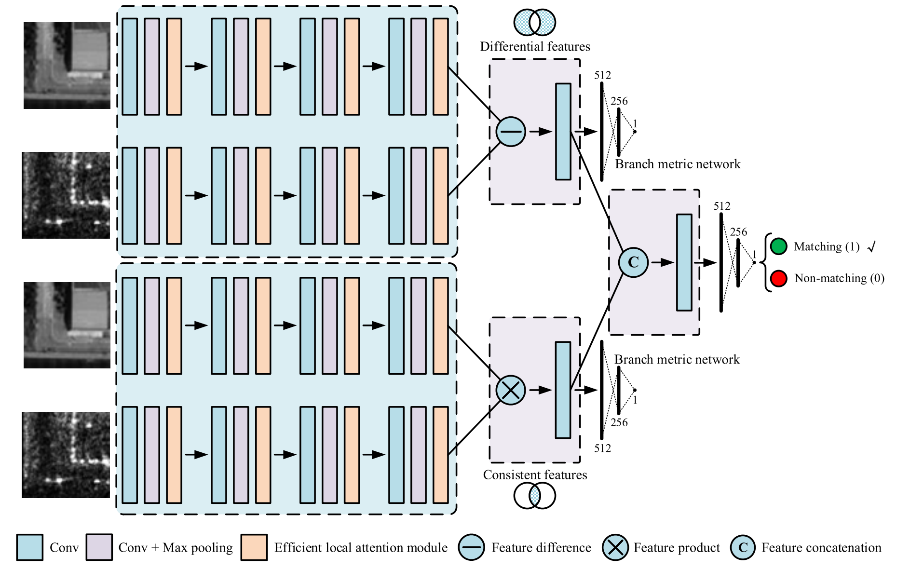
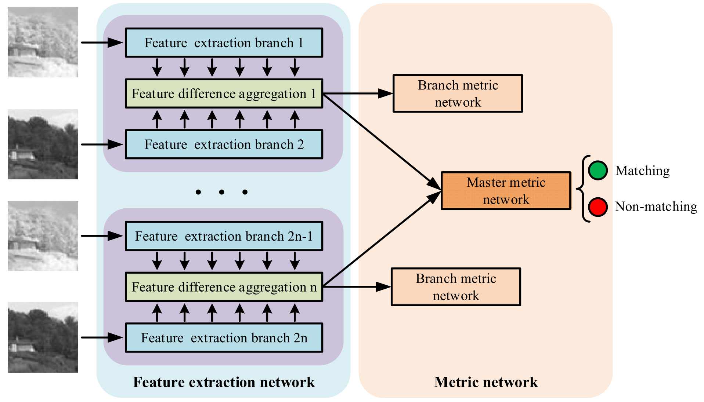








<h1 style="border-bottom: none;">Welcome to my website! 😆😆😆</h1>

I am now working on Multi-image/video understanding and reasoning, Infrared small target detection, and Multimodal image registration. If you are seeking any form of academic cooperation (学术合作), please feel free to email me at [**yuchuang@sia.cn**](yuchuang@sia.cn) / [**yuchuang1205@163.com**](yuchuang1205@163.com). 

I am a PHD student in the University of the Chinese Academy of Sciences's Master-Doctor combined program, supervised by Prof. Yunpeng Liu.

Since October 2024, I have been honored to be a visiting Ph.D at [**CUHK-MMLab**](https://mmlab.ie.cuhk.edu.hk/people.html), under the supervision of Prof. [**Xiangyu Yue**](https://xyue.io/).

I won the CAS President Award - Special Prize (中国科学院院长特别奖, Top 0.1%) in 2025 and was twice awarded the **National Scholarship for PHD Students** in 2022 and 2024.

I won **the 1st place** of _Water Body Extraction from High-resolution and Multi-modal Optical Images in the 2024 ISPRS TC I Contest on Intelligent Interpretation for Multi-modal Remote Sensing Application_ (Team leader) and **the 1st prize** in the _PRCV2024 Wide-area Infrared Small Target Detection Challenge_ (Team leader).

<!--
My research interest includes neural machine translation and computer vision. I have published more than 100 papers at the top international AI conferences with total <a href='https://scholar.google.com/citations?user=DhtAFkwAAAAJ'>google scholar citations <strong>260000+</strong></a> (You can also use google scholar badge ).
-->

# 🔥 News 🔥 
-*2022.02*: &nbsp;🎉🎉 

<!--
- *2022.02*: &nbsp;🎉🎉 Lorem ipsum dolor sit amet, consectetur adipiscing elit. Vivamus ornare aliquet ipsum, ac tempus justo dapibus sit amet. 
--> 

# 📝 Publications 

-----

  
  

    <h3>MIND: Multi-rationale INtegrated Discriminative Reasoning Framework for Multi-modal Large Models</h3>
    

      <strong><u>Chuang Yu</u></strong>, Jinmiao Zhao, Mingxuan Zhao, Yunpeng Liu*, Xiujun Shu, Yuanhao Feng, Bo Wang, Xiangyu Yue* 

      <strong style="display:inline-block; margin:6px 0;">arXiv Preprint, 2025</strong>
    

    

      We propose MIND, a multi-rationale integrated discriminative reasoning framework that enhances multi-modal large models through structured rationale integration and hard negative discrimination.
    

    

      <a href="https://arxiv.org/abs/2512.05530">Paper</a> |
      <!-- | <a href="https://mind-project.github.io/">Project</a> -->
      <a href="https://github.com/YuChuang1205/MIND">Code</a>
    

  

  
  

    <h3>Rethinking Infrared Small Target Detection: A Foundation-Driven Efficient Paradigm</h3>
    

      <strong><u>Chuang Yu</u></strong>, Jinmiao Zhao, Yunpeng Liu*, Yaokun Li, Xiujun Shu, Yuanhao Feng, Bo Wang, Yimian Dai, Xiangyu Yue* 

      <strong style="display:inline-block; margin:6px 0;">arXiv Preprint, 2025</strong>
    

    

      We rethink infrared small target detection from a foundation-model perspective and propose an efficient, foundation-driven paradigm that improves generalization and deployment efficiency across diverse infrared scenarios.
    

    

      <a href="https://arxiv.org/abs/2512.05511">Paper</a> |
      <!-- | <a href="https://your-project-page.github.io/">Project</a> -->
      <a href="https://github.com/YuChuang1205/FDEP-Framework">Code</a>
    

  

  
  

    <h3>From Easy to Hard: Progressive Active Learning Framework for Infrared Small Target Detection with Single Point Supervision</h3>
    

      <strong><u>Chuang Yu</u></strong>, Jinmiao Zhao, Yunpeng Liu*, Sicheng Zhao, Yimian Dai, Xiangyu Yue* 

      <strong style="display:inline-block; margin:6px 0;">ICCV 2025 (Accepted)</strong>
    

    

      We propose a progressive active learning framework that transitions from easy to hard samples for infrared small target detection under single-point supervision, significantly reducing annotation cost while improving detection robustness.
    

    

      <a href="https://openaccess.thecvf.com/content/ICCV2025/html/Yu_From_Easy_to_Hard_Progressive_Active_Learning_Framework_for_Infrared_ICCV_2025_paper.html">Paper</a> |
      <a href="https://github.com/YuChuang1205/PAL">Code</a>
      🔥 Github 200+⭐
    

  

  
  

    <h3>Why and How: Knowledge-Guided Learning for Cross-Spectral Image Patch Matching</h3>
    

      <strong><u>Chuang Yu</u></strong>, Yunpeng Liu*, Jinmiao Zhao, Xiangyu Yue* 

      <strong style="display:inline-block; margin:6px 0;">arXiv Preprint, 2025</strong>
    

    

      We present a knowledge-guided learning framework that explicitly models the “why” and “how” of cross-spectral discrepancies, enabling robust and discriminative patch matching across heterogeneous spectral domains.
    

    

      <a href="https://arxiv.org/abs/2412.11161">Paper</a> |
      <a href="https://github.com/YuChuang1205/KGL-Net">Code</a>
    

  

  
  

    <h3>Multi-Scale Direction-Aware Network for Infrared Small Target Detection</h3>
    

      Jinmiao Zhao, Zelin Shi*, <strong><u>Chuang Yu</u></strong>, Yunpeng Liu, Xinyi Ying, Yimian Dai 

      <strong style="display:inline-block; margin:6px 0;">IEEE Transactions on Geoscience and Remote Sensing, 2025 (Accepted)</strong>
    

    

      We propose a multi-scale direction-aware network that explicitly models directional and scale-sensitive cues, significantly enhancing infrared small target detection performance under complex backgrounds.
    

    

      <a href="https://arxiv.org/abs/2406.02037">Paper</a> |
      <a href="https://github.com/YuChuang1205/MSDA-Net">Code</a>
      🔥 Github 100+⭐
    

  

  
  

    <h3>Towards Robust Infrared Small Target Detection: A Feature-Enhanced and Sensitivity-Tunable Framework</h3>
    

      Jinmiao Zhao, Zelin Shi*, <strong><u>Chuang Yu</u></strong>, Yunpeng Liu, Yimain Dai 

      <strong style="display:inline-block; margin:6px 0;">Knowledge-Based Systems, 2025 (Accepted)</strong>
    

    

      We propose a feature-enhanced and sensitivity-tunable framework that improves robustness for infrared small target detection by adaptively balancing feature representation and detection sensitivity under complex backgrounds.
    

    

      <a href="https://arxiv.org/abs/2407.20090">Paper</a> |
      <a href="https://github.com/YuChuang1205/FEST-Framework">Code</a>
    

  

  
  

    <h3>Relational Representation Learning Network for Cross-Spectral Image Patch Matching</h3>
    

      <strong><u>Chuang Yu</u></strong>, Yunpeng Liu*, Jinmiao Zhao, Dou Quan, Xiangyu Yue* 

      <strong style="display:inline-block; margin:6px 0;">Information Fusion, 2024 (Accepted)</strong>
    

    

      We propose a relational representation learning network that explicitly models cross-spectral relationships, enabling robust and discriminative image patch matching across heterogeneous spectral modalities.
    

    

      <a href="https://arxiv.org/abs/2403.11751">Paper</a> |
      <a href="https://github.com/YuChuang1205/RRL-Net">Code</a>
    

  

  
  

    <h3>Feature Interaction Learning Network for Cross-Spectral Image Patch Matching</h3>
    

      <strong><u>Chuang Yu</u></strong>, Yunpeng Liu*, Jinmiao Zhao, Shuhang Wu, Zhuhua Hu 

      <strong style="display:inline-block; margin:6px 0;">IEEE Transactions on Image Processing, 2023 (Accepted)</strong>
    

    

      We propose a feature interaction learning network that explicitly models inter-feature relationships across heterogeneous spectra, significantly improving robustness and discriminability for cross-spectral image patch matching.
    

    

      <a href="https://ieeexplore.ieee.org/document/10251126">Paper</a> |
      <a href="https://github.com/YuChuang1205/VIS-LWIR-patch-dataset">Data1</a> |
      <a href="https://github.com/YuChuang1205/SEN1-2-patch-dataset">Data2</a> |
      <a href="https://github.com/YuChuang1205/RRL-Net">Code</a>
    

  

  
  

    <h3>Efficient Feature Relation Learning Network for Cross-Spectral Image Patch Matching</h3>
    

      <strong><u>Chuang Yu</u></strong>, Jinmiao Zhao, Yunpeng Liu*, Shuhang Wu, Chenxi Li 

      <strong style="display:inline-block; margin:6px 0;">IEEE Transactions on Geoscience and Remote Sensing, 2023 (Accepted)</strong>
    

    

      We propose an efficient feature relation learning network that models cross-spectral feature interactions with low computational overhead, achieving accurate and scalable image patch matching across heterogeneous spectral modalities.
    

    

      <a href="https://ieeexplore.ieee.org/document/10164118">Paper</a> |
      <a href="https://github.com/YuChuang1205/OS-patch-dataset">Data</a> |
      <a href="https://github.com/YuChuang1205/RRL-Net">Code</a>
    

  

  
  

    <h3>Multi-branch Feature Difference Learning Network for Cross-Spectral Image Patch Matching</h3>
    

      <strong><u>Chuang Yu</u></strong>, Yunpeng Liu*, Chenxi Li et al. 

      <strong style="display:inline-block; margin:6px 0;">IEEE Transactions on Geoscience and Remote Sensing, 2022 (Accepted)</strong>
    

    

      We propose a multi-branch feature difference learning network that explicitly captures cross-spectral discrepancies via complementary branches, enabling robust and discriminative image patch matching across heterogeneous spectral domains.
    

    

      <a href="https://ieeexplore.ieee.org/document/9777946">Paper</a> |
      <a href="https://github.com/YuChuang1205/MFD-Net">Code1</a> |
      <a href="https://github.com/YuChuang1205/RRL-Net">Code2</a>
    

  

# 🏆 Honors and Awards
- *2025* <strong>CAS President Award – Special Prize (中国科学院院长特别奖) (Top 0.1%)</strong>  ([news report](http://www.sia.cas.cn/xwzx/zhxw/202506/t20250624_7874445.html))
- *2024* <strong>The 1st place of Water Body Extraction from High-resolution and Multi-modal Optical Images in the 2024 ISPRS TC I Contest on Intelligent Interpretation for Multi-modal Remote Sensing Application (Team leader)</strong> ([news report](http://www.sia.cas.cn/xwzx/kydt/202405/t20240527_7173244.html))
- *2024* <strong>The 1st prize in the PRCV2024 Wide-area Infrared Small Target Detection Challenge (Team leader)</strong> ([news report](http://www.sia.cas.cn/xwzx/kydt/202411/t20241113_7438837.html))
- *2024* The 2nd prize in the ICPR 2024 Resource-Limited Infrared Small Target Detection Challenge Track 1. (Team leader)
- *2024* The 2nd prize in the ICPR 2024 Resource-Limited Infrared Small Target Detection Challenge Track 2. (Team leader)
- *2024* The 3rd prize of the First "Shensi Cup" - Urban Lifeline·AI Problem Solving Challenge. (Team leader)
- *2024* The 3rd place of Marine Farms Segmentation in High-Resolution SAR Images in the 5TH Gaofen Challenge on Automated High Resolution Earth Observation Image Interpretation (Team leader)
- *2024 and 2022* <strong>National Scholarship (Top 1%)</strong>
- *2024* <strong>Outstanding Communist Youth League Member of CAS (Top 0.1%) </strong>  ([news report](http://www.sia.cas.cn/dj/gzdt/202405/t20240509_7156313.html))
- *2023* Outstanding Graduate Student Award of Shenyang Institute of Automation, CAS (Top 1%)
- *2023 and 2024* <strong>Pacemaker to Merit Student of the University of Chinese Academy of Sciences (Top 1%)</strong>
- *2021, 2023 and 2024* First Class Academic Scholarship of Shenyang Institute of Automation, CAS (Top 10%)
- *2020* Outstanding Graduates (Top 1%)
- *2019* The 2nd prize of China Collegiate Computing Contest Artificial Intelligence Innovation Contest. (Team leader)

<!--
# 🚀 Some personal news reports:
- **CAS President Award – Special Prize**（中国科学院院长特别奖） 
- **1st Place**, Water Body Extraction, *ISPRS TC I Contest 2024* 
- **1st Prize**, PRCV 2024 Wide-area Infrared Small Target Detection Challenge 
- **Outstanding Communist Youth League Member of CAS** 
-->

<!--
# 💻 Internships
- *2019.05 - 2020.02*, [Lorem](https://github.com/), China.
-->

# ⚡ Academic Service:
- Conference Reviewer: CVPR, ICCV, ICPR, etc.
- Journal Reviewer: TGRS, Inf. Fusion, KBS, ESWA, EAAI, JSTARS, IPT,  Neurocomputing, etc.  

# 🎯 Hobbies
- 🍳 Cooking and exploring different cuisines
- 🏃 Running and physical conditioning
- 🎧 Music appreciation
- 🎬 Watching films
