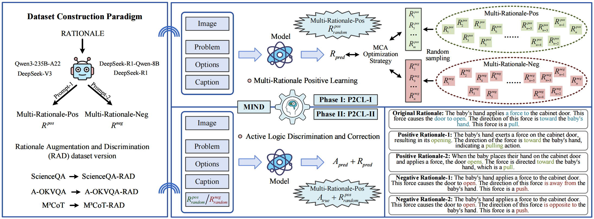
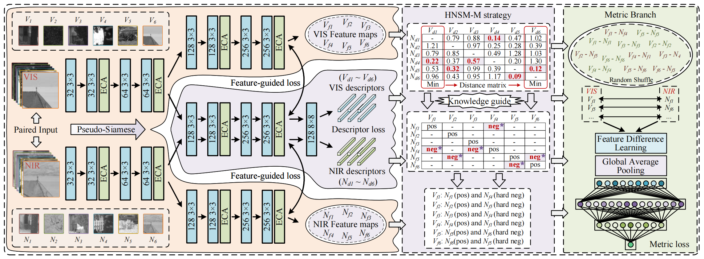
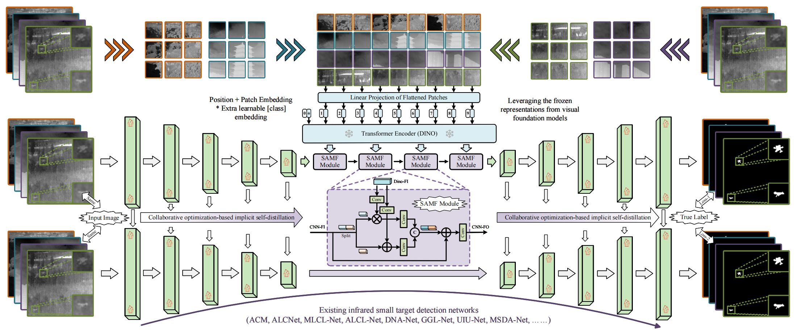
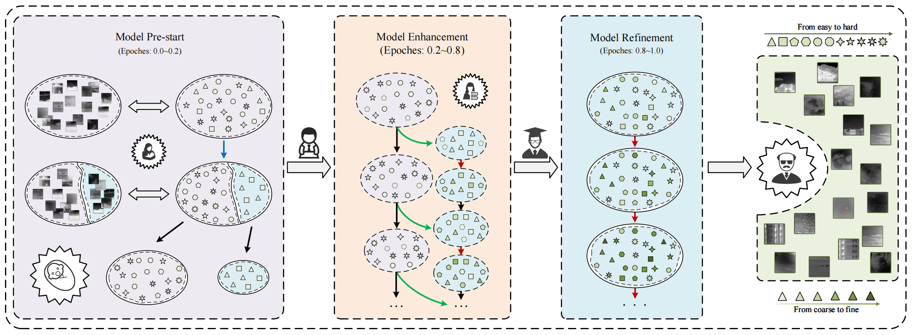
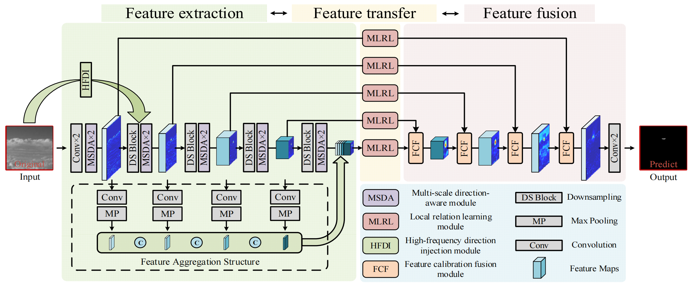
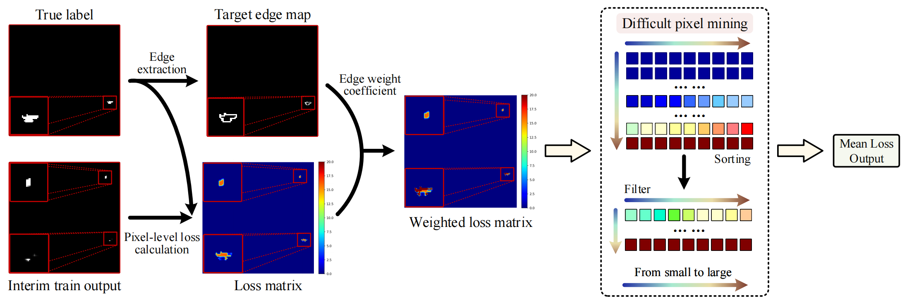
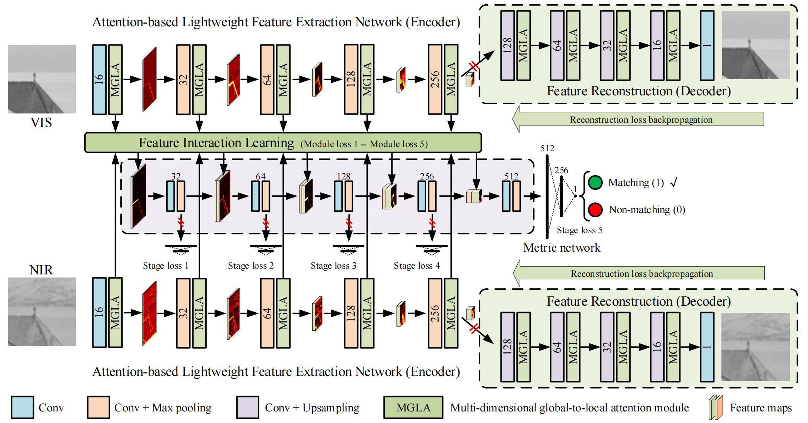
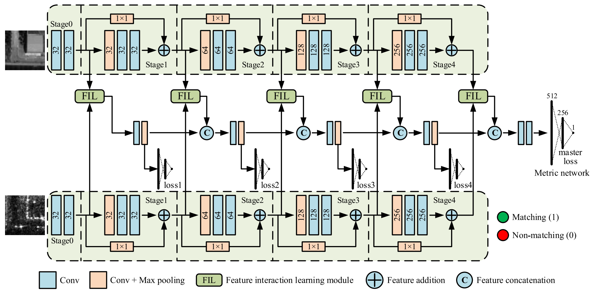
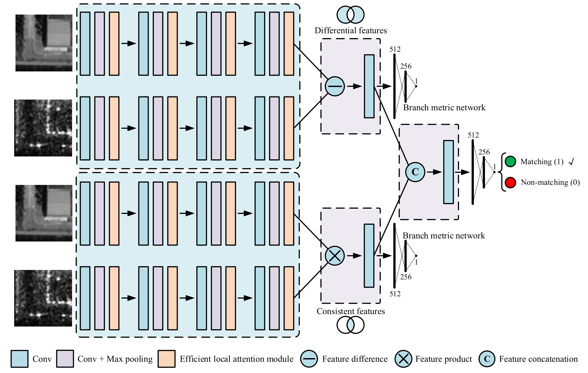
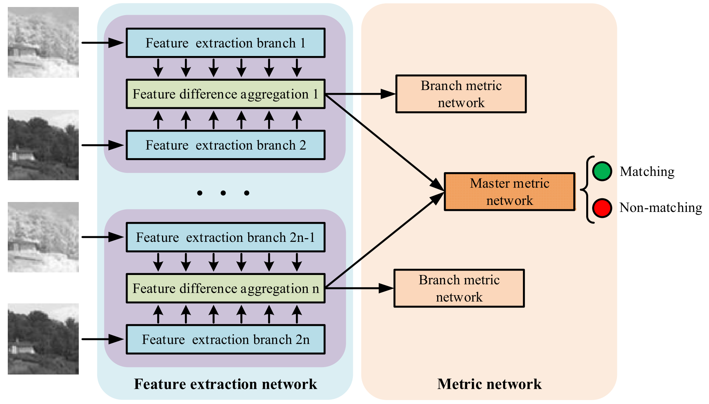








<h1 style="border-bottom: none;">Welcome to my website! 😆😆😆</h1>

I am now working on Multi-image/video understanding and reasoning, Infrared small target detection, and Multimodal image registration. If you are seeking any form of **academic cooperation (学术合作)**, please feel free to email me at [**yuchuang@sia.cn**](yuchuang@sia.cn) / [**yuchuang1205@163.com**](yuchuang1205@163.com). 

<!--
I am a PHD student in the SIA-CAS's Master-Doctor combined program, supervised by Prof. Yunpeng Liu.

Since October 2024, I have been honored to be a Research Assistant at [**CUHK-MMLab**](https://mmlab.ie.cuhk.edu.hk/people.html), under the supervision of Prof. [**Xiangyu Yue**](https://xyue.io/).
-->
I have been honored to be a **Postdoc** at **CUHK-MMLab** around September 2026, under the supervision of Prof. [**Xiangyu Yue**](https://xyue.io/).

I was honored with the CAS President Award - Special Prize (**中国科学院院长特别奖**) in 2025, the Outstanding Graduates of Beijing (**北京市优秀毕业生**) in 2026 and was twice awarded the **National Scholarship for Ph.D. Students** in 2022 and 2024.

I won **the 1st place** of _Water Body Extraction from High-resolution and Multi-modal Optical Images in the 2024 ISPRS TC I Contest on Intelligent Interpretation for Multi-modal Remote Sensing Application_ (Team leader) and **the 1st prize** in the _PRCV2024 Wide-area Infrared Small Target Detection Challenge_ (Team leader).

<!--
My research interest includes neural machine translation and computer vision. I have published more than 100 papers at the top international AI conferences with total <a href='https://scholar.google.com/citations?user=DhtAFkwAAAAJ'>google scholar citations <strong>260000+</strong></a> (You can also use google scholar badge ).
-->

# 🔥 News 🔥 
-*2026.07*: &nbsp;🎉🎉 One paper [**KGL-Net**](https://github.com/YuChuang1205/KGL-Net) is accepted by **TIP 2026**. 
-*2026.06*: &nbsp;🌸🌸 Honored with the  **Outstanding Graduates of Beijing**. 
-*2026.05*: &nbsp;🎉🎉 One paper [**MIND**](https://arxiv.org/abs/2512.05530) is accepted by **ICML 2026**. 
-*2026.04*: &nbsp;🌸🌸 Honored with the  **Outstanding Graduates of University of Chinese Academy of Sciences**. 
-*2025.12*: &nbsp;🌟🌟 Our new works, [**MIND**](https://arxiv.org/abs/2512.05530) and [**FDEP Framework**](https://arxiv.org/abs/2512.05511), have been released. 
-*2025.11*: &nbsp;🎉🎉 One paper ([**MSDA-Net**](https://github.com/YuChuang1205/MSDA-Net)) is accepted by **TGRS 2025**. 
-*2025.09*: &nbsp;🎉🎉 One paper ([**RRL-Net**](https://github.com/YuChuang1205/RRL-Net)) is accepted to **Information Fusion 2025**. 
-*2025.06*: &nbsp;🎉🎉 One paper ([**PAL Framework**](https://github.com/YuChuang1205/PAL)) is accepted to **ICCV 2025**. 
-*2025.05*: &nbsp;🌸🌸 Honored with the  **CAS President Award – Special Prize**. 
-*2024.11*: &nbsp;🥇🥇 Awarded **1st Prize** in the *PRCV2024 Wide-area Infrared Small Target Detection Challenge*. 
-*2024.11*: &nbsp;🥇🥇 Awarded **2nd Prize** in the *ICPR 2024 Resource-Limited Infrared Small Target Detection Challenge Track 1 and Track2*. 
-*2024.11*: &nbsp;🌸🌸 Honored with the **National Scholarship**. 
-*2024.05*: &nbsp;🥇🥇 Awarded **1st Place** in the *2024 ISPRS TC I Contest on Intelligent Interpretation for Multi-modal Remote Sensing Application*. 
-*2023.10*: &nbsp;🎉🎉 One paper ([**FIL-Net**](https://github.com/YuChuang1205/RRL-Net)) is accepted to **TIP 2023**. 
-*2023.06*: &nbsp;🎉🎉 One paper ([**EFR-Net**](https://github.com/YuChuang1205/RRL-Net)) is accepted to **TGRS 2023**. 
-*2022.11*: &nbsp;🌸🌸 Honored with the **National Scholarship**. 
-*2022.06*: &nbsp;🎉🎉 One paper ([**MFD-Net**](https://github.com/YuChuang1205/RRL-Net)) is accepted to **TGRS 2022**. 
-*2022.06*: &nbsp;🎉🎉 One paper is accepted to **J-START 2022**. 
-*2022.05*: &nbsp;🎉🎉 Two paper ([**MLCL-Net**](https://doi.org/10.1016/j.infrared.2022.104107)) and ([**ALCL-Net**](https://ieeexplore.ieee.org/document/9785618)) is accepted to **IPT 2022** and **GRSL 2022**. 

# 📝 Publications (Some representative papers)

-----

  
  

    <h3>MIND: Multi-rationale INtegrated Discriminative Reasoning Framework for Multi-modal Large Models</h3>
    

      <strong><u>Chuang Yu</u></strong>, Jinmiao Zhao, Mingxuan Zhao, Yunpeng Liu*, Xiujun Shu, Yuanhao Feng, Bo Wang, Xiangyu Yue* 

      <strong style="display:inline-block; margin:6px 0;">ICML 2026 (Accepted)</strong>
    

    

      We propose a Multi-rationale INtegrated Discriminative (MIND) reasoning framework, which is designed to endow MLLMs with human-like cognitive abilities of “Understand → Rethink → Correct”, and achieves a paradigm evolution from passive imitation-based reasoning to active discriminative reasoning.
    

    

      <a href="https://arxiv.org/abs/2512.05530">Paper</a> |
      <!-- | <a href="https://mind-project.github.io/">Project</a> -->
      <a href="https://github.com/YuChuang1205/MIND">Code</a>
    

  

  
  

    <h3>Why and How: Knowledge-Guided Learning for Cross-Spectral Image Patch Matching</h3>
    

      <strong><u>Chuang Yu</u></strong>, Yunpeng Liu*, Jinmiao Zhao, Ao Chen, Xiujun Shu, Bo Wang, Zelin Shi, Xiangyu Yue* 

      <strong style="display:inline-block; margin:6px 0;">IEEE Transactions on Image Processing, 2026 (Accepted)</strong>
    

    

      We make the first attempt to explore a stable and efficient bridge between descriptor learning and metric learning, and construct a knowledge-guided learning network (KGL-Net), which achieves amazing performance improvements while abandoning complex network structures.
    

    

      <a href="https://arxiv.org/abs/2412.11161">Paper</a> |
      <a href="https://github.com/YuChuang1205/KGL-Net">Code</a>
    

  

  
  

    <h3>Rethinking Infrared Small Target Detection: A Foundation-Driven Efficient Paradigm</h3>
    

      <strong><u>Chuang Yu</u></strong>, Jinmiao Zhao, Yunpeng Liu*, Yaokun Li, Xiujun Shu, Yuanhao Feng, Bo Wang, Yimian Dai, Xiangyu Yue* 

      <strong style="display:inline-block; margin:6px 0;">arXiv Preprint, 2025</strong>
    

    

      We systematically introduce the frozen representations from VFMs into the SIRST task for the first time and propose a Foundation-Driven Efficient Paradigm (FDEP), which can seamlessly adapt to existing encoder-decoder-based methods and significantly improve accuracy without additional inference overhead.
    

    

      <a href="https://arxiv.org/abs/2512.05511">Paper</a> |
      <!-- | <a href="https://your-project-page.github.io/">Project</a> -->
      <a href="https://github.com/YuChuang1205/FDEP-Framework">Code</a>
    

  

  
  

    <h3>From Easy to Hard: Progressive Active Learning Framework for Infrared Small Target Detection with Single Point Supervision</h3>
    

      <strong><u>Chuang Yu</u></strong>, Jinmiao Zhao, Yunpeng Liu*, Sicheng Zhao, Yimian Dai, Xiangyu Yue* 

      <strong style="display:inline-block; margin:6px 0;">ICCV 2025 (Accepted)</strong>
    

    

      Inspired by organisms gradually adapting to their environment and continuously accumulating knowledge, we construct an innovative Progressive Active Learning (PAL) framework, which drives the existing SIRST detection networks progressively and actively recognizes and learns harder samples.
    

    

      <a href="https://openaccess.thecvf.com/content/ICCV2025/html/Yu_From_Easy_to_Hard_Progressive_Active_Learning_Framework_for_Infrared_ICCV_2025_paper.html">Paper</a> |
      <a href="https://github.com/YuChuang1205/PAL">Code</a>
      🔥 Github 200+⭐
    

  

  
  

    <h3>Multi-Scale Direction-Aware Network for Infrared Small Target Detection</h3>
    

      Jinmiao Zhao, Zelin Shi*, <strong><u>Chuang Yu</u></strong>, Yunpeng Liu, Xinyi Ying, Yimian Dai 

      <strong style="display:inline-block; margin:6px 0;">IEEE Transactions on Geoscience and Remote Sensing, 2025 (Accepted)</strong>
    

    

      We propose a multi-scale direction-aware network (MSDA-Net), which is the first attempt to integrate the high-frequency directional features of infrared small targets as domain prior knowledge into neural networks.
    

    

      <a href="https://arxiv.org/abs/2406.02037">Paper</a> |
      <a href="https://github.com/YuChuang1205/MSDA-Net">Code</a>
      🔥 Github 100+⭐
    

  

<!-- 

  
  

    <h3>Towards Robust Infrared Small Target Detection: A Feature-Enhanced and Sensitivity-Tunable Framework</h3>
    

      Jinmiao Zhao, Zelin Shi*, <strong><u>Chuang Yu</u></strong>, Yunpeng Liu, Yimain Dai 

      <strong style="display:inline-block; margin:6px 0;">Knowledge-Based Systems, 2025 (Accepted)</strong>
    

    

      Different from most existing deep learning-based methods that focus on improving network architectures, we propose a feature-enhanced and sensitivitytunable (FEST) framework, which is compatible with existing SIRST detection networks and further enhances their detection performance. 
    

    

      <a href="https://arxiv.org/abs/2407.20090">Paper</a> |
      <a href="https://github.com/YuChuang1205/FEST-Framework">Code</a>
    

  

 -->

  
  

    <h3>Relational Representation Learning Network for Cross-Spectral Image Patch Matching</h3>
    

      <strong><u>Chuang Yu</u></strong>, Yunpeng Liu*, Jinmiao Zhao, Dou Quan, Xiangyu Yue* 

      <strong style="display:inline-block; margin:6px 0;">Information Fusion, 2024 (Accepted)</strong>
    

    

      We propose an innovative relational representation learning idea that simultaneously focuses on sufficiently mining the intrinsic features of individual image patches and the relations between image patch features. Based on this, we construct a Relational Representation Learning Network (RRL-Net).
    

    

      <a href="https://arxiv.org/abs/2403.11751">Paper</a> |
      <a href="https://github.com/YuChuang1205/RRL-Net">Code</a>
    

  

  
  

    <h3>Feature Interaction Learning Network for Cross-Spectral Image Patch Matching</h3>
    

      <strong><u>Chuang Yu</u></strong>, Yunpeng Liu*, Jinmiao Zhao, Shuhang Wu, Zhuhua Hu 

      <strong style="display:inline-block; margin:6px 0;">IEEE Transactions on Image Processing, 2023 (Accepted)</strong>
    

    

     We propose a novel two-branch feature interaction learning network (FIL-Net), which can effectively mine common and private features between cross-spectral image patches, and extract richer and deeper feature relations with invariance and discriminability.
    

    

      <a href="https://ieeexplore.ieee.org/document/10251126">Paper</a> |
      <a href="https://github.com/YuChuang1205/VIS-LWIR-patch-dataset">Data1</a> |
      <a href="https://github.com/YuChuang1205/SEN1-2-patch-dataset">Data2</a> |
      <a href="https://github.com/YuChuang1205/RRL-Net">Code</a>
    

  

  
  

    <h3>Efficient Feature Relation Learning Network for Cross-Spectral Image Patch Matching</h3>
    

      <strong><u>Chuang Yu</u></strong>, Jinmiao Zhao, Yunpeng Liu*, Shuhang Wu, Chenxi Li 

      <strong style="display:inline-block; margin:6px 0;">IEEE Transactions on Geoscience and Remote Sensing, 2023 (Accepted)</strong>
    

    

      We construct a novel four-branch efficient feature relation learning network (EFR-Net), which reasonably combines multiple feature relation learning to comprehensively and effectively extract the differential features and consistent features between image patches.
    

    

      <a href="https://ieeexplore.ieee.org/document/10164118">Paper</a> |
      <a href="https://github.com/YuChuang1205/OS-patch-dataset">Data</a> |
      <a href="https://github.com/YuChuang1205/RRL-Net">Code</a>
    

  

  
  

    <h3>Multi-branch Feature Difference Learning Network for Cross-Spectral Image Patch Matching</h3>
    

      <strong><u>Chuang Yu</u></strong>, Yunpeng Liu*, Chenxi Li et al. 

      <strong style="display:inline-block; margin:6px 0;">IEEE Transactions on Geoscience and Remote Sensing, 2022 (Accepted)</strong>
    

    

      We propose a novel multibranch feature difference learning network (MFD-Net), which can capture richer and more discriminative feature difference information and achieve significant improvements on matching tasks.
    

    

      <a href="https://ieeexplore.ieee.org/document/9777946">Paper</a> |
      <a href="https://github.com/YuChuang1205/MFD-Net">Code1</a> |
      <a href="https://github.com/YuChuang1205/RRL-Net">Code2</a>
    

  

# 🏆 Honors and Awards
- *2026* <strong>Outstanding Graduates of Beijing (北京市优秀毕业生) </strong>
- *2026* Outstanding Graduates of University of Chinese Academy of Sciences (Top 2%)
- *2025* <strong>CAS President Award – Special Prize (中国科学院院长特别奖) </strong>  ([news report](http://www.sia.cas.cn/xwzx/zhxw/202506/t20250624_7874445.html))
- *2024* <strong>The 1st place of Water Body Extraction from High-resolution and Multi-modal Optical Images in the 2024 ISPRS TC I Contest on Intelligent Interpretation for Multi-modal Remote Sensing Application (Team leader)</strong> ([news report](http://www.sia.cas.cn/xwzx/kydt/202405/t20240527_7173244.html))
- *2024* <strong>The 1st prize in the PRCV2024 Wide-area Infrared Small Target Detection Challenge (Team leader)</strong> ([news report](http://www.sia.cas.cn/xwzx/kydt/202411/t20241113_7438837.html))
- *2024* The 2nd prize in the ICPR 2024 Resource-Limited Infrared Small Target Detection Challenge Track 1. (Team leader)
- *2024* The 2nd prize in the ICPR 2024 Resource-Limited Infrared Small Target Detection Challenge Track 2. (Team leader)
- *2024* The 3rd prize of the First "Shensi Cup" - Urban Lifeline·AI Problem Solving Challenge. (Team leader)
- *2024* The 3rd place of Marine Farms Segmentation in High-Resolution SAR Images in the 5TH Gaofen Challenge on Automated High Resolution Earth Observation Image Interpretation (Team leader)
- *2024 and 2022* <strong>National Scholarship (Top 1%)</strong>
- *2024* <strong>Outstanding Communist Youth League Member of CAS (Top 0.1%) </strong>  ([news report](http://www.sia.cas.cn/dj/gzdt/202405/t20240509_7156313.html))
- *2023* Outstanding Graduate Student Award of Shenyang Institute of Automation, CAS (Top 1%)
- *2023 and 2024* <strong>Pacemaker to Merit Student of the University of Chinese Academy of Sciences (Top 1%)</strong>
- *2021, 2023 and 2024* First Class Academic Scholarship of Shenyang Institute of Automation, CAS (Top 10%)
- *2020* **Outstanding Graduates** (Top 1%)
- *2019* The 2nd prize of China Collegiate Computing Contest Artificial Intelligence Innovation Contest. (Team leader)

<!--
# 🚀 Some personal news reports:
- **CAS President Award – Special Prize**（中国科学院院长特别奖） 
- **1st Place**, Water Body Extraction, *ISPRS TC I Contest 2024* 
- **1st Prize**, PRCV 2024 Wide-area Infrared Small Target Detection Challenge 
- **Outstanding Communist Youth League Member of CAS** 
-->

<!--
# 💻 Internships
- *2019.05 - 2020.02*, [Lorem](https://github.com/), China.
-->

# ⚡ Academic Service:
- Conference Reviewer: CVPR, ICCV, ICML, NeurIPS, ECCV ICPR, etc.
- Journal Reviewer: TGRS, Inf. Fusion, KBS, ESWA, EAAI, JSTARS, IPT,  Neurocomputing, etc.  

# 🎯 Hobbies
- 🍳 Cooking and exploring different cuisines
- 🏃 Running and physical conditioning
- 🎧 Music appreciation
- 🎬 Watching films
